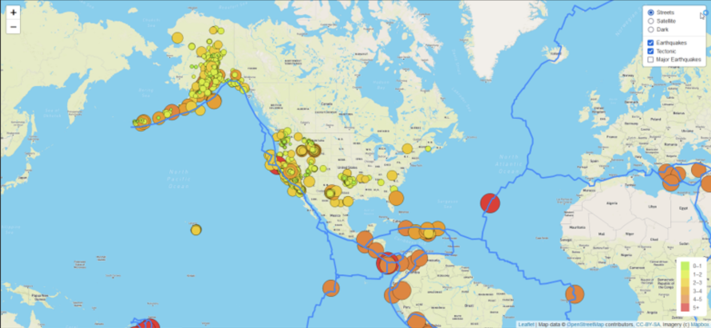
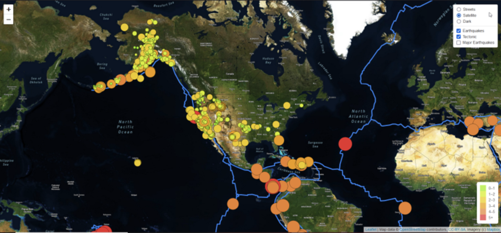
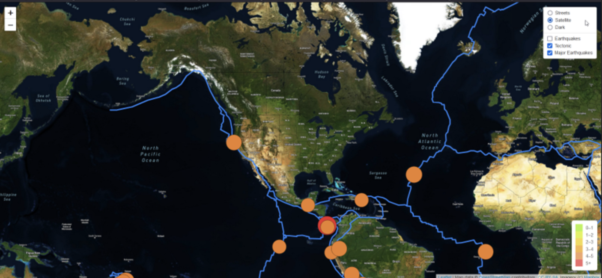
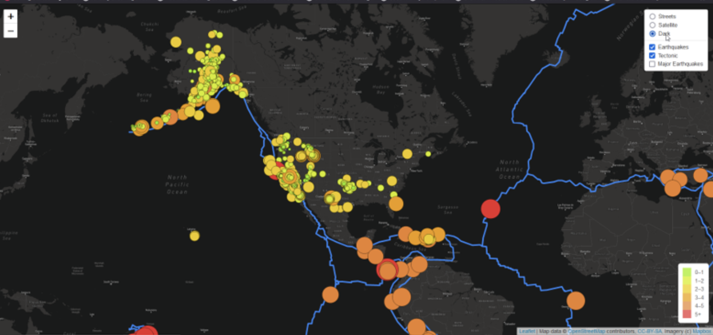
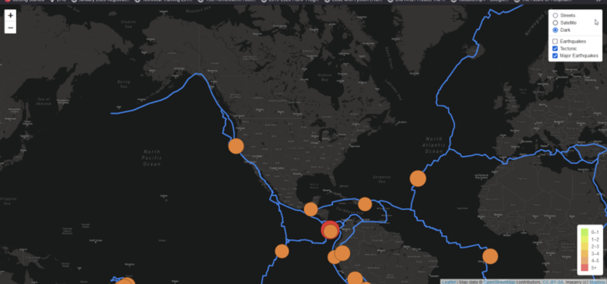
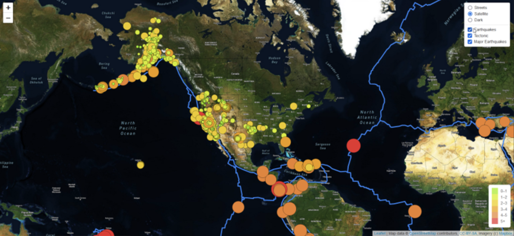

# Mapping_Earthquakes
The Mapping_Earthquakes project is about telling earthquake stories with data. We would be building insightful data visualization with interactive features on earthquakes from around the world. We would utilize the latest earthquake GeoJSON data from the US Geological Survey website. We would traverse and retrieve the earthquake data using JavaScript and the D3.js and Leaflet libraries and plot the map data on a Mapbox map through an AI request. 

We will display the magnitude and location of the earthquake on a popup marker on our final map. The diameter of each map marker will correspond to the magnitude, size, and color of the earthquake. Earthquakes with larger magnitudes will appear larger and darker in color, with a legend providing context for the map data. Finally, to illustrate the relationship between location and frequency of seismic activity and tectonic plates, we would add faultlines on the map. At the end of the project, we would have implemented visualization that is aesthetically pleasing and interactive.

- Purpose:
The purpose of this project is to visually show the differences between the magnitudes of earthquakes all over the world for the last seven days.

- Tasks:
To complete this project, we would use URLs for GeoJSON earthquake data, and GeoJSON major earthquake data from the USGS website and retrieve geographical coordinates and the magnitudes of earthquakes for the last seven days. We would also use a URL to map tectomic plates, and finally we would add the data to a map.

- Approach:
We will use the JavaScript and the D3.js library to retrieve the coordinates and magnitudes of the earthquakes from the GeoJSON data. Next, we will use the Leaflet library to plot the data on a Mapbox map through an API request and create interactivity for the earthquake data.

#### Tools
1. Mapbox API
2. D3.js library
3. Leaflet: an open-source JavaScript library for mobile-friendly interactive maps
4. HTML and CSS to render and style the webpage
5. GeoJSON

#### Control Flow
1. Create a folder structure to hold the index.html file, and the JavaScript files
2. Create HTML page that will hold the map
3. In a Javascript file that will hold the following code:
   * create three tile layers that will serve as background for the earthquake and tectonic plate data
   * Create the map object with center, zoom level and default layer.
   * Create a base layer that holds all three maps.
   * add map layers for all three maps
   * Add a reference to the tectonic plates group, the earthquakes, and the major earthquakes group to the overlays object
   * Then we add a control to the map that will allow the user to change which layers are visible.
   * Retrieve the earthquake GeoJSON data, the major earthquake GeoJSON data, and the tectonic plates data
   * finally, we add functions to style, color, and bind popup to the map markers

### Results

#### Earthquakes with Faultlines - Street Layer

#### Earthquakes with Faultlines- Satellite Layer

#### Earthquakes with Faultlines - Dark Layer

#### All Earthquakes with Faultlines - Satellite Layer

